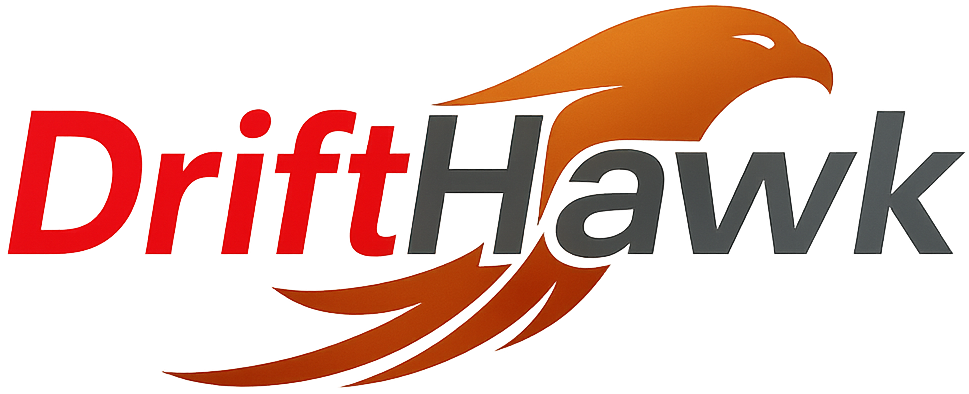

# *Spot drift. Ship proof.*
Provision and govern private-cloud and OpenShift with Terraform and Argo CD, enforce OPA policies, sign and attest supply chain, automate approvals via ChatOps, and continuously validate gates with a red-team harness.

## Outcomes

* Lower change risk with explainable plans and policy gates
* Faster, reversible promotions with live status and one-click rollback
* Auditable releases with signed evidence bundles
* Continuous drift detection and auto-PR remediation
* Clear cost impact on every pull request

## What’s inside

* **Terraform multi-module stack:** IPAM → Load Balancer → Proxy → OpenShift
* **Policy checks:** OPA/Conftest for safety, tags, RBAC, network rules
* **GitOps:** Argo CD apps with pinned digests, overlays, canary, rollback
* **Supply chain:** Cosign signatures, SBOM generation and verification
* **Cost impact:** Infracost PR comments with deltas and budgets
* **Resource graph:** Terraform DOT → PNG artifact attached to plans
* **Approvals path:** Jira/ServiceNow change flow integrated with promotions
* **Drift Scout:** scheduled drift detection that opens remediation PRs
* **Red-Team Harness:** malicious change and rollout scenarios that must fail

## AI agents

* **Change Planner:** turns `terraform plan -json` + policy results into an Impact Brief with blast radius, dependencies, cost delta, and risk score
* **Release Conductor:** validates gates, promotes via Argo, monitors health, exposes rollback and posts status to ChatOps
* **Compliance Packager:** assembles signed audit bundles with SBOMs, digests, plan/apply hashes, test reports, and Argo app status

## Architecture

```
PR → CI (fmt/validate/plan → OPA → SBOM/sign → Infracost → TF graph)
          │
          ▼
   Impact Brief (Change Planner) → PR comment
          │ approvals via Jira/ServiceNow
          ▼
     Argo CD promotion (Release Conductor)
          │
          ▼
   Audit bundle (Compliance Packager)
          │
Nightly → Drift Scout → auto PRs
Nightly/Weekly → Red-Team Harness → expect policy failures
```

## Repository layout

```
/terraform/{ipam,lb,proxy,openshift}
# envs under /terraform/envs/{dev,staging,prod}

/policy/{opa,conftest}
/gitops/{apps,overlays,rollouts}
/ops-bot/{app,connectors/{jira,servicenow},schemas,routes}
/audit/{sbom,attestations,bundles}
/tools/graph/graph.sh
/redteam/{terraform,supply_chain,rollout,reports,run_redteam.sh}
/ci/.github/workflows
/delivery-kit/{rmodp,traceability,risk,adr,stories}
```

## API & ChatOps (Ops Bot)

* `POST /chatops/plan-brief` → returns Impact Brief JSON and markdown
* `POST /chatops/promote` → validates gates and triggers rollout
* `POST /change/submit` → opens change in Jira and optionally mirrors to ServiceNow, waits for approvals, then promotes
* `GET  /chatops/status/{id}` → rollout health, links, rollback handle
* Slash commands: `/plan-brief`, `/promote`, `/status`, `/change submit`

## CI workflows (high level)

* **Plan & Policy:** `terraform fmt/validate/plan` → export plan JSON → OPA → PR comment with Impact Brief
* **Supply chain:** build, SBOM (Syft), vuln scan (Grype), cosign sign and verify
* **Infracost:** cost breakdown and diff posted to PR
* **TF graph:** generate DOT → PNG and upload as artifact
* **Release:** tag triggers Compliance Packager to emit signed bundle
* **Drift Scout:** scheduled job runs `terraform refresh`, raises fix PRs
* **Red-Team:** scheduled job applies attack patches and expects gates to block

## Security and compliance

* Image, manifest, and bundle signatures with cosign
* SBOMs attached to releases and verified in CI
* Secrets via Sealed Secrets or Key Vault examples
* NetworkPolicies and namespace RBAC examples for OpenShift

## Observability

* OpenTelemetry traces across plan, policy, promote, rollback, and agent actions
* Prometheus metrics and Grafana dashboards for change lead time, rollout duration, failure rate, MTTR, policy bypass rate, and drift findings

## KPIs

* Change lead time
* Change failure rate
* Mean time to rollback
* Audit evidence assembly time
* Drift MTTR and recurrence
* Policy bypass rate (red-team)
* Monthly cost variance and per-change delta

## Getting started

```bash
make init
make policy.test
make tf.plan env=dev
make brief                 # generate Impact Brief from latest plan
make argo.sync env=staging
make change.submit env=prod summary="Promote to prod" risk=0.23
make redteam.run          # run malicious scenarios, expect gates to block
make drift.run            # run Drift Scout manually
```

## Configuration

Populate `ops-bot/.env` or GitHub Actions secrets:

* `JIRA_BASE`, `JIRA_USER`, `JIRA_TOKEN`
* `SNOW_INSTANCE`, `SNOW_USER`, `SNOW_TOKEN` (optional)
* `COSIGN_PRIVATE_KEY`, `COSIGN_PASSWORD`
* `REGISTRY_USERNAME`, `REGISTRY_PASSWORD`
* `INFRACOST_API_KEY` (optional)
* Cloud credentials for Terraform envs

## Roadmap

* Cost Guard budgets per workspace with PR fail thresholds
* Capacity forecasts from cluster metrics
* Automated rollback suggestions based on SLO burn
